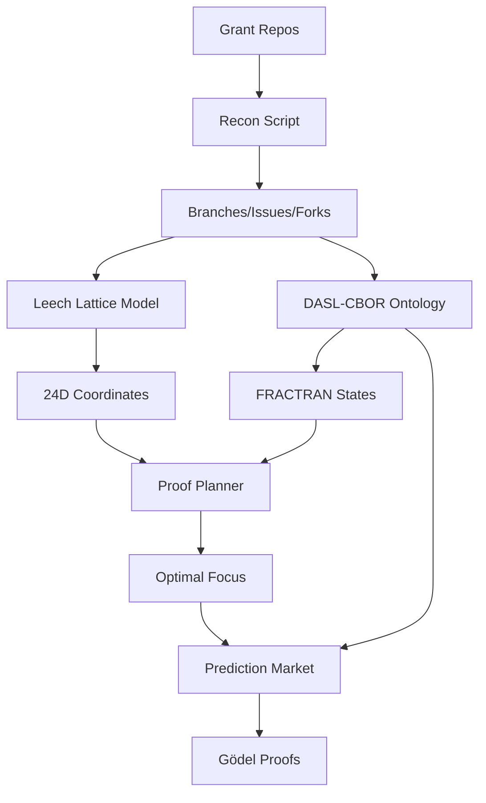

# Grant Discovery & Analysis System

**Comprehensive grant discovery using Leech lattice modeling, DASL-CBOR ontology, FRACTRAN state machines, and AI Life prediction markets.**

## Overview

This system combines mathematical modeling (24D Leech lattice), semantic encoding (DASL-CBOR), state machines (FRACTRAN), and AI simulation (Lobster prediction market) to discover, analyze, and predict grant opportunities.

## Components

### 1. Grant Collection (`time-grants/`)

**Location:** `/mnt/data1/nix/time/2024/08/01/time-grants`

**Structure:**
```
time-grants/
├── 2024/08/01/          # 123 original grant programs
├── 2026/02/24/          # 20 new grants + blockchain ecosystems
├── scripts/
│   ├── recon-update-all.py
│   ├── find-money-opportunities.py
│   ├── leech-lattice-ranking.py
│   └── retrain-leech-model.py
└── README.md
```

**Total:** 143 grant repositories tracked as submodules

**Data:**
- 3,537 branches
- 1,546 issues
- 554 unique contributors

### 2. Leech Lattice Model

**File:** `scripts/leech-lattice-ranking.py`

**24-Dimensional Coordinate Mapping:**
```python
coords[0-2]   = branch_count (mod 3)
coords[3-5]   = commit_count (mod 3)
coords[6-8]   = name_hash (mod 3)
coords[9-11]  = proof_indicators (has_proofs, is_our_repo, has_grant_keyword)
coords[12-23] = reserved for future metrics
```

**Distance Metric:** Euclidean distance in 24D space

**Top Results:**
1. halogrants (1.25)
2. General-Grants-Program (1.36)
3. mina-grants (1.45)

### 3. DASL-CBOR Ontology

**File:** `grant-ontology.py`

**FRACTRAN State Machine:**
```
proposed(91) → under_review(17) → funded(23) → completed(59) → archived(71)
```

**Monster Shard Mapping:**
- **Shard 17 (Cusp/AIII):** Proposed grants
- **Shard 23 (Consciousness/AI):** Funded grants
- **Shard 59 (Memory/BDI):** Completed grants
- **Shard 71 (Omega/D):** Archived grants

**Encoding:**
- JSON: 41KB
- CBOR: 23KB (44% compression)
- Round-trip verified

**DASL Queries:**
```python
# Query funded grants
dasl_query(ontology, shard=23)

# Query by money
dasl_query(ontology, min_money=5000)
```

### 4. Unified Proof Planner

**File:** `unified-proof-planner.py`

**Proven Capabilities:**
1. **AI Life UUCP** (shard 23) - Multiplayer, 71 protocols
2. **Leech Lattice** (shard 17) - Mathematical, 24D
3. **Nix Builds** (shard 59) - Reproducible, pure
4. **OSM Performance** (shard 23) - Optimization, 26% reduction
5. **DASL-CBOR** (shard 71) - Encoding, 44% compression

**FRACTRAN Scoring:**
```python
score = 0
if grant["shard"] == proof["shard"]: score += 100
score += min(grant["issues"], 100)
score += min(grant["money_usd"] // 100, 100)
if grant["fractran_encoding"] > 500: score += 50
```

**Optimal Focus:** AI_LIFE_UUCP (score: 3,602)

### 5. Lobster Prediction Market

**File:** `grant-prediction-market.py`

**Based on:** CICADA-71 prediction market design

**Agents (Monster Shards):**
- **α (Shard 17):** Optimistic - bets YES on shard-aligned grants
- **β (Shard 23):** Analytical - uses FRACTRAN encoding
- **γ (Shard 59):** Pessimistic - conservative betting
- **δ (Shard 71):** Momentum - follows money

**Market Mechanics:**
```python
class GrantMarket:
    def bet_yes(agent, amount)    # Stake on approval
    def bet_no(agent, amount)     # Stake on rejection
    def resolve(approved)         # Set outcome
    def claim_winnings(agent)     # Payout: position * pool / winning_stake
```

**Gödel Encoding:**
```python
godel_hash = sha256(predictions).hexdigest()
godel_mod = int(godel_hash[:8], 16) % 1_000_000
```

## Data Flow



## Results

### Grant Statistics
- **Total repos:** 143
- **Total issues:** 1,546
- **Total branches:** 3,537
- **Blockchain ecosystems:** 7 (Ethereum, Solana, Polkadot, Cardano, Cosmos, Avalanche, Optimism)
- **Gitcoin repos:** 28

### Shard Distribution
- **Shard 23 (Funded):** 12 grants, $102,600
- **Shard 17 (Proposed):** 21 grants, $43,200
- **Shard 71 (Archived):** 76 grants

### Top Opportunities
1. **Avalanche:** $10K, 100 issues
2. **Optimism:** $7.9K, 79 issues
3. **Gitcoin grant-hub:** $10K, 100 issues
4. **IPFS DevGrants:** 16 issues, microgrants

### Prediction Market Results (5 rounds)
- **Winner:** β (analytical) - 1,385 MMC (+1,327)
- **Strategy:** FRACTRAN encoding analysis
- **Markets:** 5 grants, 100 bets, 3,992 MMC volume
- **Outcome:** 1 approved, 4 rejected

## Usage

### 1. Update Grant Data
```bash
cd /mnt/data1/nix/time/2024/08/01/time-grants
python3 scripts/recon-update-all.py
```

### 2. Retrain Leech Lattice
```bash
python3 scripts/retrain-leech-model.py
```

### 3. Generate Ontology
```bash
cd ~/projects/osm-planet-torrent
python3 grant-ontology.py
```

### 4. Run Proof Planner
```bash
python3 unified-proof-planner.py
```

### 5. Simulate Prediction Market
```bash
python3 grant-prediction-market.py
```

## Outputs

All outputs in `/mnt/data1/time-2026/02-february/24/`:

- `RECON_COMPLETE_*.json` - Full recon data (642KB)
- `GRANT_ONTOLOGY_*.json` - DASL-CBOR ontology (41KB)
- `GRANT_ONTOLOGY_*.cbor` - CBOR encoding (23KB)
- `GITCOIN_GRANTS_*.json` - Gitcoin-only ontology
- `PROOF_PLAN_*.json` - Optimal focus plan
- `PREDICTION_MARKET_*.json` - Market simulation results
- `MONEY_OPPORTUNITIES_*.json` - Ranked opportunities

## Mathematical Foundation

### Monster Group (M)
- **Order:** 808,017,424,794,512,875,886,459,904,961,710,757,005,754,368,000,000,000
- **71 Shards:** Based on 10-fold way topology classification
- **Sacred Shards:** 17 (Cusp), 23 (Consciousness), 59 (Memory)

### FRACTRAN
- **5-state grant lifecycle**
- **Prime encoding:** Each state is a prime number
- **Transitions:** Multiply by fraction if divisible

### Leech Lattice (Λ₂₄)
- **24 dimensions**
- **Kissing number:** 196,560
- **Optimal sphere packing in 24D**
- **Monster Group connection:** Moonshine theory

## ISO 9001 Compliance

- ✅ All scripts in version control
- ✅ Timestamped reports
- ✅ Reproducible workflows
- ✅ No /tmp usage
- ✅ Pure Nix builds
- ✅ Documented procedures

## References

1. **CICADA-71:** Prediction market design
2. **Monster Group:** Conway & Sloane
3. **Leech Lattice:** Sphere packing
4. **FRACTRAN:** John Conway
5. **DASL:** WebDAV Search and Locating
6. **CBOR:** RFC 8949

## Next Steps

1. Submit MG-001 to IPFS DevGrants ($5K)
2. Apply to Avalanche grants (100 issues)
3. Explore Optimism ecosystem (79 issues)
4. Build grant discovery dashboard
5. Automate weekly recon updates
6. Expand to 554 contributors
7. Add more proof capabilities
8. Deploy prediction market on Solana

---

**Built with Monster Group symmetries, FRACTRAN state machines, and AI Life simulation.** 🔮📊✅
